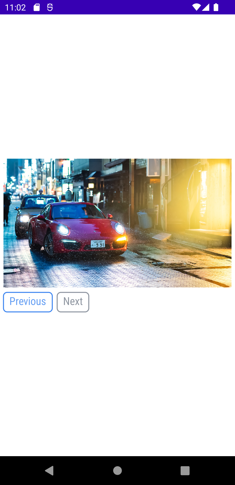

# Apex

Apex is just a simple proof of concept to demonstrate how easily you can build your own UI Toolkit
from scratch. This code base is most likely full of bugs and design mistakes but it should help
you understand the basics of a UI Toolkit. It is meant as a learning and demonstration tool only.

Tested only in an emulator and only on API level 31.

## Concepts

Widgets are called elements and are all instances of the `Element` class. Apex elements are not
intended to be subclassed, instead you build widgets by adding components to an element. Each
component has a single responsibility: layout, rendering, input event, or whatever else you want.
Components can be anything, and in the current codebase some are classes, some are interfaces, some
are enums.

For instance a `Button` is an `Element` with the following components:

- A `ButtonModel` (text, click listener, etc.), the public API of a button
- A `RenderComponent`, to render the button
- A `LayoutComponent`, to compute its own size and position the text
- A `MotionInputComponent`, to react the touch events and handle clicks
- An `InternalState`, to track the pressed state of the button

Apex also offers `Provider` instances, which are roughly equivalent to Jetpack Compose's composition
locals. They give access to global data throughout the tree: `Resources`, display density, the
current theme, etc. Any `Element` can inject new providers or override existing providers by using
the `ProviderComponent` component. `MainActivity` shows an example of using a `ThemeProvider` to
modify the current theme.

## Exercises for the reader

If you'd like to play with this codebase a bit, here are a few things you could try:

- Optimize components lookup. Right now, every lookup iterates over a flat list. It's not a big deal
  since most elements will have a short list but this could be improved. Since it's intended that an
  element can own multiple components of the same type, you'd probably have a data structure that
  maps component types to a list (a linked hashmap for instance)
- Optimize providers handling. Every layout/render/motion input phase currently re-applies the
  providers. It's not very efficient. And the layout phase doesn't correctly apply the providers at
  every level of the tree
- Take the `MotionInputComponent` from `Button` and make it a generic, reusable API so you can
  perform clicks on the `Image` widget in `MainActivity` as well
- Track changes in data models to re-layout/re-draw only when needed
- Don't relayout/redraw on *every* v-sync. It's wasteful
- Reduce memory allocations (esp. generated by the many `RectF` and `SizeF` instances, among
  other things)
- Cleanup the inline/noinline/crossinline and reified generic mess in the various helper functions
- Make this a multi-platform UI Toolkit! Remove Android-specific APIs (`Canvas`, `Bitmap`, etc.)
  and use your own abstractions. For rendering, use [skiko](https://github.com/JetBrains/skiko)

## Screenshot

Not super exciting, but here it is:

## License

See [LICENSE](./LICENSE).
